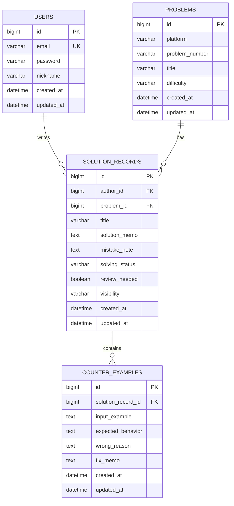

# AlgoLog

알고리즘 문제 풀이 과정을 구조화해서 기록하는 backend project입니다.

블로그나 노션에 풀이를 자유롭게 적는 방식은 편하지만, 문제 정보, 오답 원인, 반례, 복습 필요 여부를 일관된 기준으로 다시 찾기 어렵습니다. AlgoLog는 풀이 기록을 `Problem`, `SolutionRecord`, `CounterExample`로 분리해 저장하고, 사용자가 자신의 문제 풀이 과정을 복습 가능한 데이터로 관리할 수 있게 만드는 것을 목표로 합니다.

> Status: MVP implemented
>
> Current stage: AlgoLog MVP 핵심 API 구현

## Why I Built This

알고리즘 문제를 풀다 보면 정답 코드보다 중요한 정보가 따로 남습니다.

- 어떤 반례에서 틀렸는지
- 왜 그 접근이 실패했는지
- 어떤 조건을 놓쳤는지
- 다시 풀어야 하는 문제인지
- 같은 문제를 다른 방식으로 풀 수 있는지

AlgoLog는 이런 정보를 단순한 게시글 본문에 섞어두지 않고, 도메인으로 분리해 관리하는 학습 기록 서비스를 지향합니다.

## Core Idea

| Domain | Role |
| --- | --- |
| `User` | 서비스를 사용하는 회원과 인증 정보 |
| `Problem` | 플랫폼, 문제 번호, 제목, 난이도 같은 문제 메타데이터 |
| `SolutionRecord` | 특정 사용자가 특정 문제에 대해 작성한 풀이 기록 |
| `CounterExample` | 풀이 과정에서 실패한 입력, 오답 원인, 수정 메모 |

핵심은 `Post`가 아니라 `SolutionRecord`를 중심 도메인으로 둔 것입니다. 문제 자체의 정보와 사용자의 풀이 기록을 분리하고, 반례를 별도 엔티티로 관리해 하나의 풀이 기록에 여러 실패 케이스를 연결할 수 있게 설계했습니다.

## Features

### MVP Scope

- 회원가입 / 로그인
- JWT 기반 인증
- 문제 등록, 조회, 검색
- 풀이 기록 작성, 조회, 수정, 삭제
- 반례 작성, 조회
- 내 풀이 기록 필터 조회
- 공개 풀이 목록 조회
- 특정 문제의 공개 풀이 조회
- 비공개 풀이 접근 제한
- 작성자 기반 수정 / 삭제 권한 처리

### Implemented

- Spring Boot Gradle 프로젝트 세팅
- H2 기반 local database 설정
- JPA Auditing 기반 `createdAt`, `updatedAt` 공통 처리
- 핵심 도메인 엔티티 구현
  - `User`
  - `Problem`
  - `SolutionRecord`
  - `CounterExample`
- Enum 설계
  - `SolvingStatus`
  - `Visibility`
- DB 제약 조건과 인덱스 설정
  - user email unique
  - problem platform + problem number unique
  - solution record author/problem/visibility index
  - counter example solution record index
- 전역 예외 처리 구조 구현
  - `ErrorCode`
  - `BusinessException`
  - `ErrorResponse`
  - `GlobalExceptionHandler`
  - Bean Validation 실패 응답 처리
- 인증 API 구현
  - 회원가입
  - 로그인
  - BCrypt 비밀번호 검증
  - JWT Access Token 발급
  - JWT 인증 필터
  - Security 인증 / 인가 실패 응답
- Problem API 구현
  - 문제 등록
  - 문제 단건 조회
  - 문제 목록 검색
  - 플랫폼, 난이도, 키워드 필터
  - 중복 문제 등록 방지
- SolutionRecord API 구현
  - 풀이 기록 작성
  - 내 풀이 기록 목록 조회
  - 풀이 기록 상세 조회
  - 풀이 기록 수정
  - 풀이 기록 삭제
  - 작성자 기준 기본 접근 제한
  - 공개 풀이 비로그인 / 타 사용자 조회 허용
  - 비공개 풀이 작성자 전용 조회
- CounterExample API 구현
  - 반례 작성
  - 특정 풀이 기록의 반례 목록 조회
  - 풀이 기록 작성자 기반 반례 작성 권한 처리
  - 풀이 기록 공개 / 비공개 기준 반례 조회 권한 처리
- 공개 풀이 탐색 API 구현
  - 공개 풀이 목록 조회
  - 특정 문제의 공개 풀이 조회
  - 플랫폼, 난이도, 해결 상태, 복습 필요 여부 필터
- Swagger / OpenAPI 문서화
  - Swagger UI 제공
  - JWT Bearer 인증 입력 지원
  - Auth, Problem, SolutionRecord, CounterExample, Public API 그룹 제공

### Next

- MySQL 환경 분리와 배포 준비
- Flyway 기반 DB migration 도입
- API smoke test script 또는 collection 추가
- 테스트 커버리지와 JWT 보안 강화

## Architecture



## Technical Decisions

### Problem and SolutionRecord are separated

같은 문제에 대해 여러 사용자가 풀이 기록을 작성할 수 있으므로, 문제 메타데이터는 `Problem`에 저장하고 사용자의 풀이 기록은 `SolutionRecord`로 분리했습니다.

### CounterExample is an entity

반례는 단순 문자열 필드보다 별도 엔티티가 적합하다고 판단했습니다. 하나의 풀이 기록에 여러 반례가 연결될 수 있고, 실패 입력, 기대 동작, 오답 원인, 수정 메모를 따로 관리할 수 있기 때문입니다.

### Relationships are kept one-way first

초기 구현에서는 양방향 연관관계를 최소화했습니다. 순환 참조와 불필요한 객체 그래프 로딩을 피하고, API 응답은 Entity가 아니라 DTO로 분리할 계획입니다.

### Error responses are centralized

기능별 API 구현 전에 `ErrorCode`, `BusinessException`, `GlobalExceptionHandler`를 먼저 구성했습니다. 이후 인증, 문제, 풀이 기록 API에서 같은 형식의 실패 응답을 반환하도록 하기 위함입니다.

## Tech Stack

| Category | Stack |
| --- | --- |
| Language | `Java 17` |
| Framework | `Spring Boot`, `Spring Web MVC` |
| Persistence | `Spring Data JPA`, `H2`, `MySQL` |
| Security | `Spring Security`, `JWT` |
| Validation | `Bean Validation` |
| Build | `Gradle` |
| Tools | `Lombok`, `Git`, `GitHub` |

## Documents

- [Project Spec](docs/project-spec.md)
- [API Spec](docs/api-spec.md)
- [ERD](docs/erd.md)
- [Development Log](docs/development-log.md)
- [Troubleshooting](docs/troubleshooting.md)

## Run Locally

Requirements:

- Java 17
- Git

Default profile is `local`, which uses in-memory H2.

```bash
./gradlew bootRun
```

Windows PowerShell:

```powershell
.\gradlew.bat bootRun
```

Run tests:

```bash
./gradlew test
```

Run API smoke test after starting the server:

```bash
./scripts/smoke-test.sh
```

Use another server URL:

```bash
BASE_URL=http://localhost:8080 ./scripts/smoke-test.sh
```

H2 Console:

- URL: `http://localhost:8080/h2-console`
- JDBC URL: `jdbc:h2:mem:algolog`
- User Name: `sa`
- Password: empty

## Run With MySQL

Use the `mysql` profile when you want to run AlgoLog against MySQL.

```bash
SPRING_PROFILES_ACTIVE=mysql \
MYSQL_URL='jdbc:mysql://localhost:3306/algolog?useSSL=false&allowPublicKeyRetrieval=true&serverTimezone=Asia/Seoul&characterEncoding=UTF-8' \
MYSQL_USERNAME=algolog \
MYSQL_PASSWORD=algolog \
JWT_SECRET='change-this-to-a-long-random-secret' \
./gradlew bootRun
```

MySQL profile environment variables:

| Variable | Default | Purpose |
| --- | --- | --- |
| `MYSQL_URL` | `jdbc:mysql://localhost:3306/algolog?...` | MySQL JDBC URL |
| `MYSQL_USERNAME` | `algolog` | MySQL user |
| `MYSQL_PASSWORD` | `algolog` | MySQL password |
| `JWT_SECRET` | required | JWT signing secret |
| `JWT_ACCESS_TOKEN_EXPIRATION_MILLIS` | `3600000` | Access token lifetime |
| `JPA_DDL_AUTO` | `update` | Hibernate schema mode until Flyway is introduced |

OpenAPI:

- Swagger UI: `http://localhost:8080/swagger-ui/index.html`
- OpenAPI JSON: `http://localhost:8080/v3/api-docs`
- Grouped docs: `auth`, `problem`, `solution-record`, `counter-example`, `public`

## API Quick Start

1. 회원가입

```bash
curl -X POST http://localhost:8080/api/auth/signup \
  -H "Content-Type: application/json" \
  -d '{"email":"user@example.com","password":"password1234","nickname":"algo_user"}'
```

2. 로그인 후 `accessToken` 확인

```bash
curl -X POST http://localhost:8080/api/auth/login \
  -H "Content-Type: application/json" \
  -d '{"email":"user@example.com","password":"password1234"}'
```

3. 인증이 필요한 API는 `Authorization` 헤더 사용

```bash
curl -X POST http://localhost:8080/api/problems \
  -H "Content-Type: application/json" \
  -H "Authorization: Bearer {accessToken}" \
  -d '{"platform":"BOJ","problemNumber":"1000","title":"A+B","difficulty":"Bronze V"}'
```
