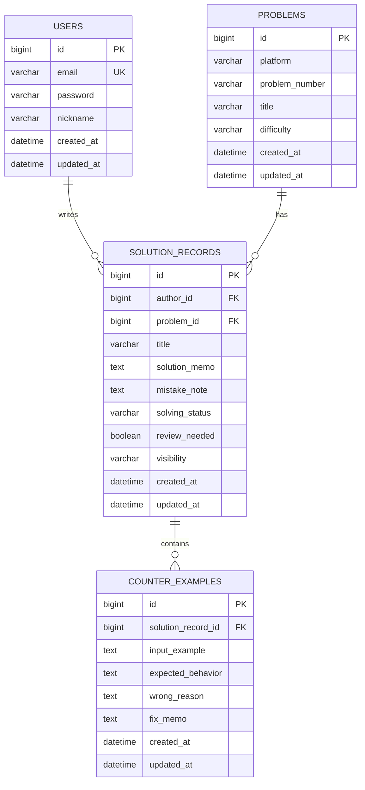

# ERD 초안

이 문서는 AlgoLog의 1차 MVP 기준 엔티티 설계 초안입니다. 구현을 진행하면서 필드명, 제약 조건, 인덱스는 일부 조정될 수 있습니다.

## 1. 설계 방향

AlgoLog의 중심 엔티티는 게시글(Post)이 아니라 **SolutionRecord** 입니다.

문제 자체의 정보는 Problem에 저장하고, 사용자가 작성한 풀이 기록은 SolutionRecord에 저장합니다. 실패한 테스트케이스와 오답 원인은 CounterExample로 분리합니다.

이렇게 나누는 이유는 다음과 같습니다.

- 같은 문제에 여러 사용자의 풀이 기록이 연결될 수 있습니다.
- 문제 정보가 풀이 기록마다 중복 저장되는 것을 줄일 수 있습니다.
- 반례를 별도 엔티티로 분리하면 하나의 풀이 기록에 여러 실패 케이스를 구조적으로 남길 수 있습니다.
- 공개 / 비공개 권한 판단은 SolutionRecord를 기준으로 처리할 수 있습니다.

## 2. ERD



## 3. 엔티티 상세

### 3.1 User

사용자와 인증 정보를 담당합니다.

| 필드 | 타입 | 제약 | 설명 |
| --- | --- | --- | --- |
| id | Long | PK | 사용자 식별자 |
| email | String | Unique, Not Null | 로그인 ID |
| password | String | Not Null | 암호화된 비밀번호 |
| nickname | String | Not Null | 서비스 내 표시 이름 |
| createdAt | LocalDateTime | Not Null | 생성 시각 |
| updatedAt | LocalDateTime | Not Null | 수정 시각 |

설계 메모:

- 이메일은 로그인 식별자로 사용하므로 유니크 제약을 둡니다.
- 비밀번호는 평문 저장하지 않고 BCrypt로 암호화합니다.
- 현재 MVP에서는 role을 생략할 수 있지만, Spring Security 확장을 고려하면 추후 `USER`, `ADMIN` 같은 권한 필드를 추가할 수 있습니다.

### 3.2 Problem

알고리즘 문제의 메타데이터를 담당합니다.

| 필드 | 타입 | 제약 | 설명 |
| --- | --- | --- | --- |
| id | Long | PK | 문제 식별자 |
| platform | String | Not Null | BOJ, PROGRAMMERS 등 플랫폼 |
| problemNumber | String | Not Null | 플랫폼 내 문제 번호 |
| title | String | Not Null | 문제 제목 |
| difficulty | String | Nullable | 난이도 |
| createdAt | LocalDateTime | Not Null | 생성 시각 |
| updatedAt | LocalDateTime | Not Null | 수정 시각 |

설계 메모:

- `platform + problemNumber` 조합은 같은 문제를 식별하는 기준이므로 유니크 제약 후보입니다.
- 난이도는 플랫폼마다 형식이 다르므로 MVP에서는 문자열로 시작하는 편이 단순합니다.
- 문제 태그는 MVP 이후 별도 테이블로 확장할 수 있습니다.

### 3.3 SolutionRecord

사용자의 특정 문제 풀이 기록을 담당합니다. AlgoLog의 핵심 엔티티입니다.

| 필드 | 타입 | 제약 | 설명 |
| --- | --- | --- | --- |
| id | Long | PK | 풀이 기록 식별자 |
| author | User | FK, Not Null | 작성자 |
| problem | Problem | FK, Not Null | 연결된 문제 |
| title | String | Not Null | 풀이 기록 제목 또는 요약 |
| solutionMemo | String | Nullable | 풀이 설명 |
| mistakeNote | String | Nullable | 실수 포인트, 막혔던 지점 |
| solvingStatus | Enum | Not Null | 해결 상태 |
| reviewNeeded | Boolean | Not Null | 복습 필요 여부 |
| visibility | Enum | Not Null | 공개 여부 |
| createdAt | LocalDateTime | Not Null | 생성 시각 |
| updatedAt | LocalDateTime | Not Null | 수정 시각 |

추천 Enum:

```java
public enum SolvingStatus {
    NOT_SOLVED,
    SOLVED,
    NEED_RETRY
}
```

```java
public enum Visibility {
    PUBLIC,
    PRIVATE
}
```

설계 메모:

- `author`와 `problem`은 다대일 관계입니다.
- 공개 / 비공개 조회 권한은 SolutionRecord의 `visibility`와 `author`를 기준으로 판단합니다.
- 풀이 기록 삭제 시 연결된 CounterExample도 함께 삭제하는 방향을 우선 고려합니다.

### 3.4 CounterExample

풀이 과정에서 실패했던 입력과 오답 원인, 수정 메모를 담당합니다.

| 필드 | 타입 | 제약 | 설명 |
| --- | --- | --- | --- |
| id | Long | PK | 반례 식별자 |
| solutionRecord | SolutionRecord | FK, Not Null | 연결된 풀이 기록 |
| inputExample | String | Not Null | 실패했던 입력 |
| expectedBehavior | String | Nullable | 기대한 동작 또는 정답 |
| wrongReason | String | Nullable | 틀린 이유 |
| fixMemo | String | Nullable | 수정 방법 또는 배운 점 |
| createdAt | LocalDateTime | Not Null | 생성 시각 |
| updatedAt | LocalDateTime | Not Null | 수정 시각 |

설계 메모:

- 하나의 SolutionRecord는 여러 CounterExample을 가질 수 있습니다.
- 반례 작성 권한은 해당 SolutionRecord의 작성자에게만 부여합니다.
- 반례 조회 권한은 SolutionRecord 조회 권한을 그대로 따릅니다.

## 4. 연관관계 정리

| 관계 | 설명 | JPA 관점 |
| --- | --- | --- |
| User 1:N SolutionRecord | 한 사용자는 여러 풀이 기록을 작성할 수 있음 | SolutionRecord에서 `@ManyToOne(fetch = LAZY)` |
| Problem 1:N SolutionRecord | 한 문제에는 여러 풀이 기록이 연결될 수 있음 | SolutionRecord에서 `@ManyToOne(fetch = LAZY)` |
| SolutionRecord 1:N CounterExample | 한 풀이 기록에는 여러 반례가 연결될 수 있음 | CounterExample에서 `@ManyToOne(fetch = LAZY)` |

초기 구현에서는 양방향 연관관계를 최소화하고, 필요한 쿼리는 Repository에서 명시적으로 조회합니다.

이유:

- 초심자 단계에서 양방향 연관관계는 편해 보이지만, 연관관계 주인, 순환 참조, JSON 직렬화 문제를 만들기 쉽습니다.
- API 응답은 Entity를 직접 반환하지 않고 DTO로 변환할 예정이므로 단방향 관계만으로도 충분합니다.

## 5. 제약 조건 후보

| 대상 | 제약 |
| --- | --- |
| users.email | Unique |
| problems.platform + problems.problem_number | Unique |
| solution_records.author_id | Index |
| solution_records.problem_id | Index |
| solution_records.visibility | Index |
| counter_examples.solution_record_id | Index |

## 6. 삭제 정책

MVP에서는 구현 단순성을 위해 우선 물리 삭제를 사용합니다.

- SolutionRecord 삭제 시 연결된 CounterExample도 삭제합니다.
- Problem은 연결된 SolutionRecord가 있다면 삭제 기능을 제공하지 않거나 제한합니다.
- User 삭제는 MVP 범위에서 제외합니다.

추후 운영 관점에서는 soft delete를 고려할 수 있습니다.

## 7. 면접에서 설명할 포인트

- Problem과 SolutionRecord를 분리한 이유는 같은 문제에 대한 여러 사용자의 풀이 기록을 표현하기 위해서입니다.
- CounterExample을 별도 엔티티로 둔 이유는 하나의 풀이에 여러 실패 케이스가 생길 수 있고, 오답 원인과 수정 과정을 구조적으로 남기기 위해서입니다.
- 공개 / 비공개 권한은 SolutionRecord의 속성이므로 게시글이 아니라 풀이 기록 자체의 도메인 규칙으로 처리합니다.
- 양방향 연관관계를 처음부터 많이 열지 않는 이유는 순환 참조와 불필요한 객체 그래프 로딩을 줄이기 위해서입니다.
